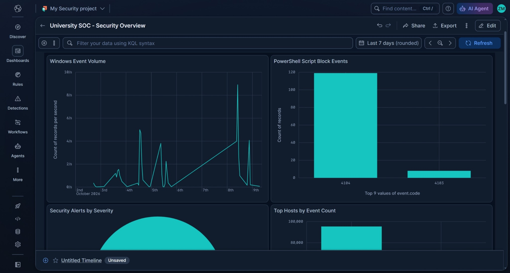
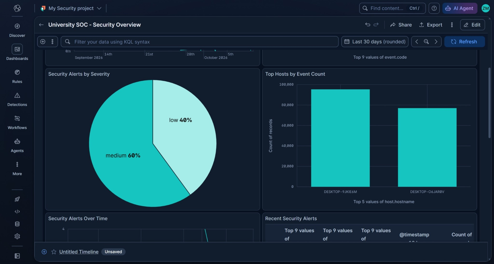
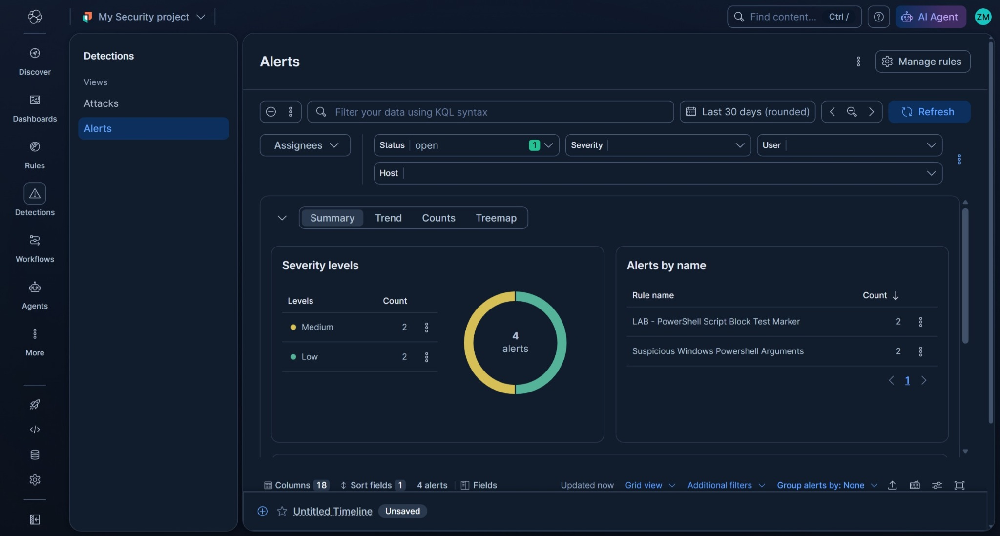
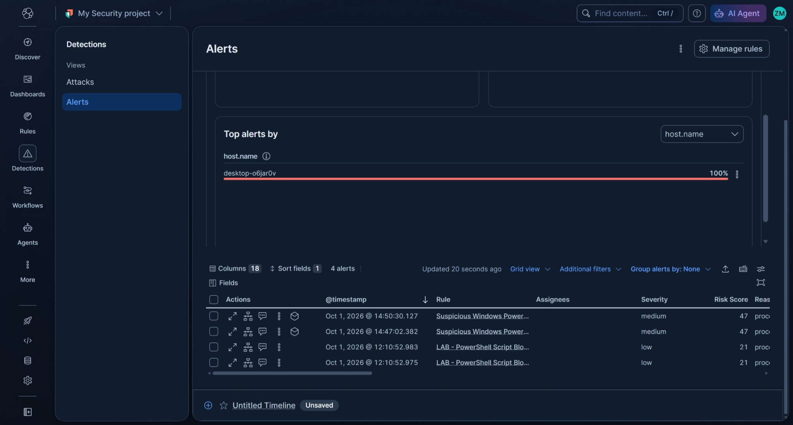
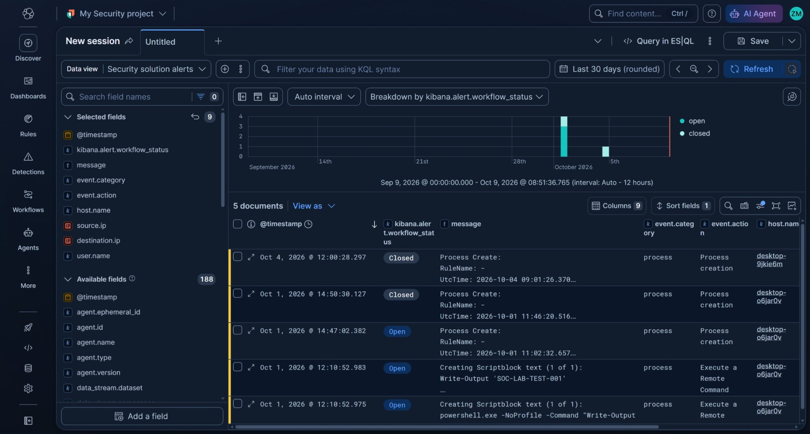

# Multi-Endpoint Security Monitoring & Detection Lab

A hands-on cybersecurity lab demonstrating how security telemetry from multiple Windows endpoints can be collected centrally, analyzed in Elastic Security, and used to generate alerts for investigation.

## Project Overview

This project focuses on the technical workflow behind centralized endpoint monitoring. Multiple lab endpoints send Windows and security-related telemetry to a central Elastic Security environment. Detection rules analyze selected events and can create alerts when activity matches a rule's conditions.

The goal is to demonstrate a practical security monitoring workflow—not to claim that every alert represents a confirmed attack or that this lab is a production SOC.

## Objectives

- Collect security telemetry from more than one Windows lab endpoint.
- Centralize endpoint events in Elastic Security.
- Ingest Windows, PowerShell Operational, and Sysmon telemetry.
- Explore process activity and PowerShell script-block events.
- Test detection rules and review the alerts they generate.
- Build a dashboard for event volume, host activity, alert severity, and recent alerts.
- Practice moving from an event to an alert and then to an investigation.

## Repository Structure

A suggested structure for this repository:

```text
multi-endpoint-security-monitoring-lab/
├── README.md
├── docs/
│   ├── architecture.md
│   ├── detection-test-cases.md
│   └── investigation-workflow.md
└── screenshots/
    ├── elastic-security-dashboard.png
    ├── detection-alert-details.png
    └── endpoint-event-evidence.png

```

## Lab Architecture

```text
Windows Endpoint A ─┐
                     ├── Elastic Agent / Fleet ──> Central Elastic Security
Windows Endpoint B ─┘                                  │
                                                       ├── Search and analysis
                                                       ├── Detection rules
                                                       ├── Security alerts
                                                       └── Dashboard and investigation
```

This is a lab architecture. The endpoints are test systems, and the setup is not represented as a production deployment.

## Technologies Used

- **Elastic Security / Elastic Stack** — centralized security analytics and alert investigation
- **Elastic Agent and Fleet** — endpoint data collection and agent management
- **Windows event logging** — operating-system and PowerShell event telemetry
- **Sysmon** — additional endpoint activity, including process creation events
- **PowerShell** — controlled test activity and script-block logging
- **VirtualBox** — isolated virtual lab environment

## Telemetry Collected

The lab includes examples of:

- Windows system and security-related events
- PowerShell Operational events, including script-block logging where configured
- Sysmon process activity
- Selected network or firewall-related telemetry where available

The available event types depend on endpoint configuration, enabled integrations, and the data sources connected to the lab.

## Detection and Validation Examples

The following controlled tests were used to validate parts of the telemetry and detection workflow:

1. **PowerShell script-block marker** — ran a harmless PowerShell command containing a unique test marker and searched for the resulting event in Elastic.
2. **Encoded PowerShell marker** — encoded a harmless `Write-Output` command to test whether command-line telemetry and relevant detection logic could be reviewed.
3. **Windows command-line activity** — generated benign commands such as `whoami` to create process telemetry for analysis.
4. **Detection rule review** — reviewed alerts from selected Elastic rules, including PowerShell-related detections.

These tests are intentionally benign. A detection alert indicates that activity matched a rule's logic; it does not, by itself, prove malicious activity or compromise. An analyst must review the host, command line, timestamp, surrounding events, and business context.

## Dashboard

The dashboard provides a central overview of selected telemetry, including:

- Windows event activity over time
- PowerShell script-block events
- Alerts by severity
- Event volume by host
- Recent security alerts
- Selected firewall or network event summaries where available

## Project Evidence

### Dashboard: Event activity and PowerShell



### Dashboard: Alert severity and host activity



### Detection alert summary



### Alert table



### Searchable alert records



These screenshots show lab activity and detection results. Alerts require investigation and should not be interpreted as automatic proof of compromise.

## Investigation Workflow Demonstrated

```text
Collect telemetry → Search and analyze events → Apply detection rules
        → Review alert → Investigate endpoint evidence → Document findings
```

The lab emphasizes that logging, detection, and investigation are related but distinct steps. Not every event is an alert, and not every alert is a confirmed incident.

## Current Scope and Limitations

- This is a proof-of-concept lab, not a production security service.
- Endpoint coverage and event quality depend on the telemetry sources and policies enabled in the lab.
- The lab demonstrates central collection and analysis; production-grade tenant isolation, high availability, retention policies, secure onboarding, incident-response procedures, and service-level commitments require additional design and testing.
- Some rule tests may create events without triggering an alert. This is expected when an event does not match a rule's conditions or when the relevant rule is not enabled or executed.
- A benign test can still trigger a heuristic or behavior-based rule. Alerts must be validated rather than treated as automatic proof of an attack.

## Future Improvements

- Add more endpoint types and validate consistent telemetry coverage.
- Improve host and environment labeling for clearer filtering.
- Add and test selected authentication, DNS, and firewall data sources.
- Develop detection notes explaining rule logic, expected false positives, and triage steps.
- Create a repeatable test plan with evidence for each scenario.
- Document event retention, access control, backup, and secure deployment considerations.


## Disclaimer

This project is for education and authorized lab testing. All tests were performed in a controlled environment using benign activity. Detection results should be investigated and interpreted in context.
